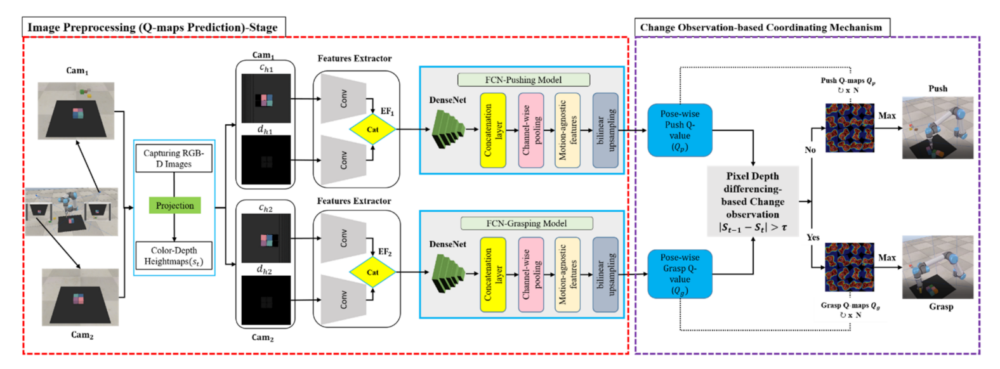
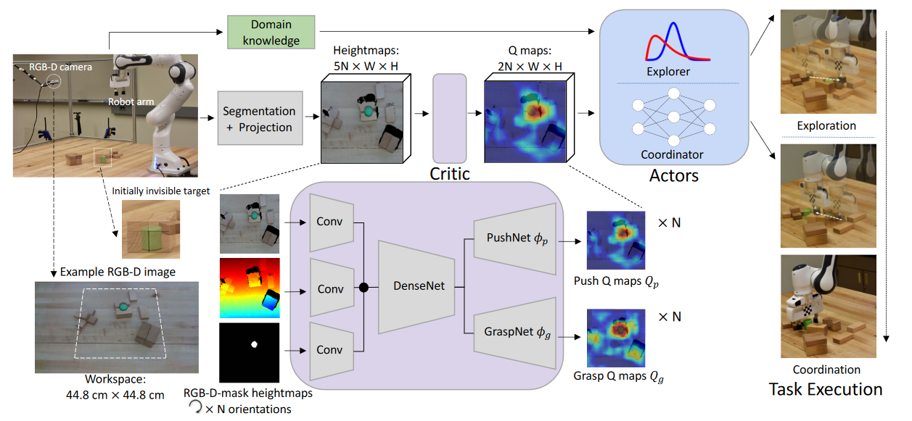
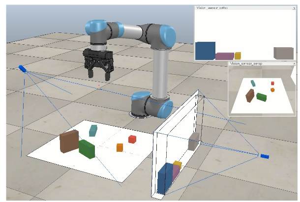
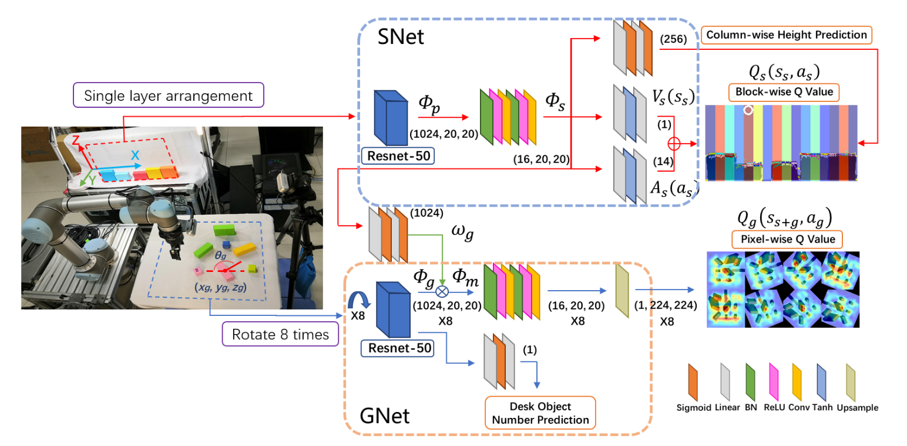

# Reinforcement-learning
强化学习之路 by-timer

### 论文一：Learning Synergies between Pushing and Grasping with Self-supervised Deep Reinforcement Learning

> 简称：VPG
>
> 会议年限：2018年IROS最佳论文奖（IROS,顶会）
>
> 代码地址：[Learning Synergies between Pushing and Grasping with Self-supervised Deep Reinforcement Learning (princeton.edu)](https://vpg.cs.princeton.edu/)

### 论文二：Self-Supervised Interactive Object Segmentation Through a Singulation-and-Grasping Approach

> 简称：SAG
>
> 期刊/会议：Computer Vision – ECCV 2022（ECCV,顶会）
>
> 代码地址：[SaG interactive Segmentation (google.com)](https://sites.google.com/umn.edu/sag-interactive-segmentation?pli=1)

### 论文三：Deep Reinforcement Learning-Based Robotic Grasping in Clutter and Occlusion

> 期刊/会议：Sustainability MDPI 2021
>
> 代码地址：无

**论文概要：**第一个挑战是推动和抓取动作的协调，在这种情况下，机器人可能偶尔无法在井然有序的物体场景中破坏物体的排列。另一方面，当在随机杂乱的对象场景中使用时，推送行为可能效率较低，因为许多对象更有可能被推出工作空间。第二个挑战是避免在抓取动作期间相机本身完全或部分被遮挡时发生的遮挡。本文提出了一种基于**多视图变化观察**的方法（MV-COBA）来克服这两个问题。所提出的方法分为两部分：（1）使用**多个摄像机设置多个视图**来解决遮挡问题； （2）利用基于**像素深度差异的视觉变化**观察来解决协调推动和抓取动作的挑战。

**方法：**

### 论文四：A Deep Learning Approach to Grasping the Invisible

> 期刊/会议：IEEE Robotics and Automation Letters 2020（RAL,顶刊)
>
> 代码地址：[Home (google.com)](https://sites.google.com/umn.edu/grasping-invisible)

**论文概要：**机器人的任务是通过一系列非抓取（例如，推动）和抓取（例如，抓取）动作来抓取**最初不可见**的目标对象。在这个问题中，需要非抓取动作来搜索目标并重新排列其周围的杂乱对象。通过以 **actor-critic** 格式制定深度强化学习方法来解决该问题。通过**深度 Q 学习**（例如推动和抓取）学习将视觉观察和目标信息映射到行动的预期奖励的评论家。建议两个演员接受评论家预测和两个子任务的领域知识：一个基于贝叶斯的演员对过去的经验进行探索性推动以搜索目标；一旦找到目标，基于分类器的 actor 就会协调面向目标的推动和抓取，以在杂乱中抓住目标。该模型完全通过机器人与环境的交互进行自我监督。

**问题描述：**机器人通过有限的推和抓序列来抓住目标，该目标可以以任意姿势和遮挡放置在密集的杂乱堆里。

- 子任务 1. 如果目标实例完全隐藏在混乱中，则机器人搜索目标并破坏结构以使其可见
- 子任务 2. 虽然待抓取的目标清晰可见，但目标实例可能被其他物体紧紧包围，没有留下抓取的空间。因此，如果不通过实例推送来打破结构化的混乱，单实例抓取是不可能的或效率低下的。在协调任务中，推送和抓取需要在时间上进行协调，以便以最高的动作效率抓住目标。

**方法：**

- `State`：固定安装的 RGB-D 相机捕捉预定义的工作空间。 RGB 图像首先被传递到预训练的语义分割模块以预测目标掩码。分割模块可以稳健地检测目标蒙版，即使在严重遮挡的情况下也是如此。然后将RGB、深度和掩模图像用已知的相机外参在重力方向上进行正交投影，以构建颜色高度图ct、深度高度图dt和目标掩模高度图mt。我们将每个状态 st 表示为场景在时间 t 的 RGB-D-mask 高度图，即 st = (ct, dt, mt)。
- `Reward`：
- `Critic`： RGB、深度和掩码高度图被送入相应的 2 层残差网络进行特征提取，输出特征被连接作为在 ImageNet上预训练的 DenseNet121的输入，以具有运动不可知特征。推网络 φp 和抓取网络 φg 将特征作为输入，分别预测推图 Qp 和抓图 Qg。网络 φp 和 φg 具有相同的架构，一个 3 层残差网络，然后是双线性上采样。
- `Actor`：
  - Exploration actor：
  - Coordination actor：

### 论文五：Towards Practical Multi-Object Manipulation using Relational Reinforcement Learning

> 期刊/会议：ICRA 2020
>
> 代码地址：[Towards Practical Multi-object Manipulation using Relational Reinforcement Learning (richardrl.github.io)](https://richardrl.github.io/relational-rl/)

**摘要：**由于数据要求高得离谱，目前使用强化学习和==稀疏奖励==来学习机器人操作任务是不切实际的。许多实际任务需要操作多个对象，并且此类任务的复杂性随着对象数量的增加而增加。从越来越复杂的任务课程中学习似乎是一个自然的解决方案，但不幸的是，它不适用于许多场景。我们假设，最先进的算法无法有效地利用任务课程是因为==缺乏将知识从简单任务转移到复杂任务的归纳偏差==。我们表明，基于==图的关系体系结构==克服了这一限制，并在提供对象数量不断增加的简单任务课程时能够学习复杂的任务。我们展示了我们的框架在==模拟块堆叠任务==上的实用性。

**密集奖励**：经常提供有关任务信息的奖励

**稀疏奖励**：可以在智能体完成整个任务后提供（即终端奖励），也可以在智能体完成关键步骤时非常间歇性地提供（即逐步奖励）。稀疏奖励比密集奖励更容易定义。然而，由于许多任务需要执行一长串动作，稀少的奖励使探索和信用分配的挑战变得非常复杂。因此，使用稀疏奖励进行训练要么完全失败，要么需要大量数据。

**问题提出**：在监督深度学习的相关领域，通过对源任务进行预训练然后对目标任务进行微调来进行知识迁移在减少数据需求方面非常成功。然而，在 RL 的背景下，从多个任务中学习并转移这些知识以减少新任务的数据需求仍然是一个开放的挑战缺乏转移的一个潜在原因是，从新任务中学习会加剧已经存在的学分分配问题。无法分配信用反过来会增加梯度的方差，从而导致学习失败。一种解决方案是调整智能体的学习速度，它只有在掌握了以前的任务后才会获得新任务（即==课程学习==）。

**问题解决**：训练由==基于注意力的图神经网络 (GNN) 表示的策略==克服了与多对象操作任务中的课程学习相关的挑战。智能体学习从头开始堆叠六个或更多块。使用简单的课程策略，当智能体掌握目标任务的块数较少时，它会增加块数。基于注意力的 GNN 通过提供适当的==归纳偏差==来在具有不同数量对象的任务之间传输知识来补充课程。

**`State`**：智能体观察抓手特征 Xee，包括抓手速度和位置，以及代表 N 个块的特征。块特征表示为 Xf : xf 1 , xf 2 , ..xf N ，其中 N ∈ [1, 9] 并且 xf i 是第 i 个块的特征表示。每个块由一个 15 维向量表示，该向量由 3D 位置 (xpi)、表示为欧拉角的 3D 方向、相对于夹持器的 3D 位置、3D 笛卡尔速度和 3D 角速度组成。目标表示为一组 3D 块位置 Xg : xg 1, xg 2, ..xg N。因此，代理的整体输入为 {Xee, Xf , Xg}。在每一集开始时，初始块位置在桌子上随机初始化，目标位置使用预先确定的分布进行采样。每集的最大长度为 50 * N 步，其中 N 是块数。

**`Reward`**：我们使用逐步稀疏奖励函数，其中机器人仅在将第 i 个块放置在距其所需目标位置 δ 的距离内时才会获得奖励。放置 N 个区块的总奖励由下式给出： ∑ i 1‖xp i −xg i ‖<δ 。我们注意到，有了这个奖励功能，机器人学会了用它的抓手抓住最上面的两个积木，而不是把它们放好然后把手移开。为了阻止这种行为，我们在奖励函数中添加了一个额外的术语 1grip_away 来鼓励机器人将手从塔上移开。仅当手与“完全堆叠”的塔的距离大于 2δ 时才会提供此额外惩罚。因此，总奖励由下式给出，rt = ∑ i 1‖xi−gi‖<δ − 1grip_away。遵循 [59] ，我们设置 δ = 5cm，即每个块的大小。

**图神经网络GNN**：暂时看不懂

**课程学习**：作者定义了三种任务

- Direct：直接学习从头开始堆叠六个块的策略。
- Uniform：在每一次训练中，块数在 1 到 6 之间均匀采样。
- Sequential：机器人的任务是首先在目标位置拾取并放置一个块，这些块被统一随机选择在桌子上或空中。然后机器人必须拾取和放置 2 个块，其中一个块的目标位置在桌子上采样，第二个块的目标位置使用上述过程采样。此后，机器人的任务是从 2 个积木开始，以单塔配置堆叠积木。在机器人完成堆叠（N-1）块后，它被赋予N块进行堆叠。 N 从 3 依次增加到 6。本课程中的过渡点是根据堆叠成功率手动选择的。

**算法描述**：SAG + HER的策略学习，SAC中的Actor和Critic采用GNN来搭建，机器人状态输入即为上述提到的{Xee, Xf , Xg}，奖励方式如上。GNN 的各个组件（φtq、φtm、φtk）使用 64D 线性层。对每轮消息传递使用单独的权重，并在 3 轮后终止消息传递。我们在第 t 轮消息传递的输出和第 t + 1 轮消息传递的输入之间使用残差连接和层归一化以简化优化。我们将此智能体架构称为 ReNN。

### 论文六：Grasp for Stacking via Deep Reinforcement Learning

> 期刊/会议：ICRA 2020
>
> 代码地址：无

**论文概要：**基于无模型的**深度 Q 学习**方法，从头开始端到端地学习抓取堆叠策略。方法通过两个深度网络将图像映射到机械臂的动作：**抓取网络（GNet）**使用桌子和桩的观察来推断抓取器的位置和方向以进行抓取；**堆叠网络（SNet）**使用观察平台以推断放置抓取物体时的最佳位置。为了制定长期规划，将这两个观察结果整合到抓取堆叠网络 (GSN) 中。

**方法：**

`State`

- 堆叠状态：二维RGB图片，沿$x,z$方向延申
- 抓取状态：RGBD图像，旋转8次，生成8维的RGBD图像输入GNet

`Reward`

- `Stack Reward`：$r_s = B^- − H^+ − O^+ − L$
  - $B^−$ 表示颠簸减少值（通过阈值为 0.3、0 和 1 的列方向高度的方差计算）。
  - $H^+$ 表示最大高度增加值（阈值为 0 或 0.7）。
  - $O^+$表示孔数。一旦缝隙被覆盖，就会形成一个洞，无法再被填补。
  - L 是一个二进制值，表示堆栈顶部是级别 (0) 还是非级别 (1)。
- `Grasp Reward`：$r_g = G − D + r_s/4$
  - 其中 G 表示抓取结果，0 表示抓取失败，1 表示抓取成功。
  - D表示物体中心与抓取位置之间的距离，对于实现高堆叠精度至关重要。

`Network Architecture`

### 论文七： Learning Visual Affordances with Target-Orientated Deep Q-Network to Grasp Objects by Harnessing Environmental Fixtures

> 期刊/会议：CAC 中国自动化大会 2021
>
> 代码地址：

### 论文八：Knowledge Induced Deep Q-Network for a Slide-to-Wall Object Grasping

> 期刊/会议：CAC 中国自动化大会 2020
>
> 代码地址：

### 论文九：Collaborative Pushing and Grasping of Tightly Stacked Objects via Deep Reinforcement Learning

> 期刊/会议：JAS 2022(IEEE/CAA Journal of Automatica Sinica)
>
> 代码地址：

### 论文十：GE-Grasp: Efficeint Target Oriented Grasping in Dense Clutter

> 期刊/会议：IROS 2022
>
> 代码地址：[CaptainWuDaoKou/GE-Grasp: GE-Grasp: Efficient Target-Oriented Grasping in Dense Clutter (IROS2022) (github.com)](https://github.com/CaptainWuDaoKou/GE-Grasp)

### 论文十一：DIPN: Deep Interaction Prediction Network with Application to Clutter Removal

> 期刊/会议：ICRA 2021
>
> 代码地址：[arc-l/dipn: Deep Interaction Prediction Network with Application to Clutter Removal (github.com)](https://github.com/arc-l/dipn)

